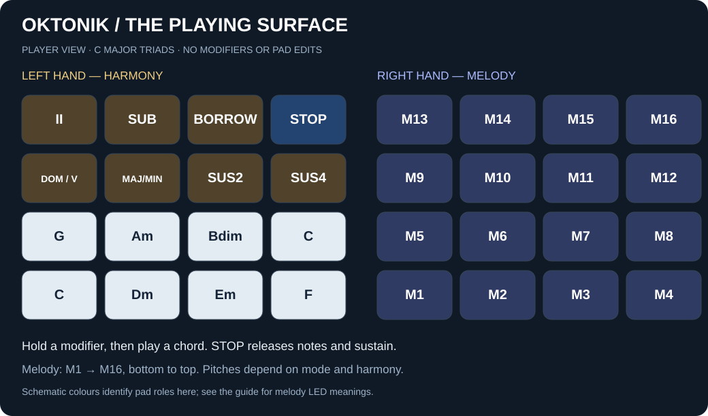
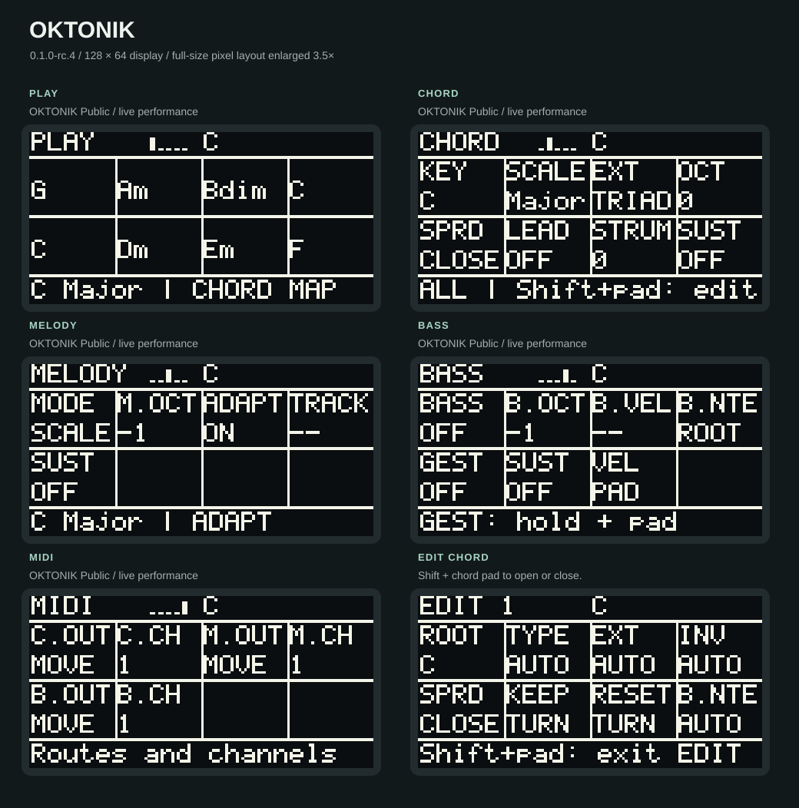
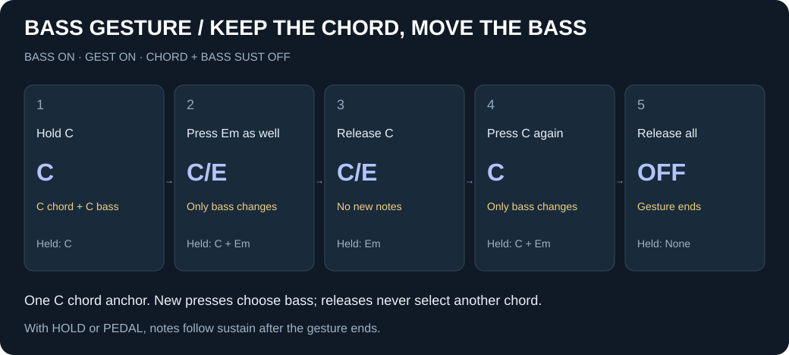
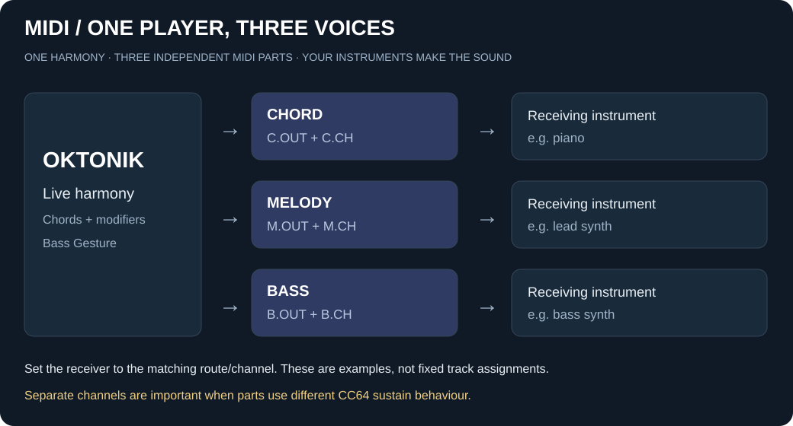

# OKTONIK user guide

**Harmonic performance instrument · by Skerry Vibe**  
For **0.1.0** on Ableton Move / Schwung **1.6.2+**.

One player, three musical parts: chords, melody and bass. OKTONIK generates
MIDI notes; your Move tracks or external instruments provide the sound.

[Published releases](https://github.com/skerryvibe/oktonik/releases) ·
[Report a bug](https://github.com/skerryvibe/oktonik/issues) · [Overview](../README.md)

## Contents

- [Install](#install)
- [Your first jam](#your-first-jam)
- [Learn the pad surface](#learn-the-pad-surface)
- [Navigate the five pages](#navigate-the-five-pages)
- [Explore with modifiers](#explore-with-modifiers)
- [Play a moving bass line](#play-a-moving-bass-line)
- [Melody modes and colours](#melody-modes-and-colours)
- [Edit one chord](#edit-one-chord)
- [Sustain and stopping notes](#sustain-and-stopping-notes)
- [Route your instruments](#route-your-instruments)
- [Troubleshooting and saves](#troubleshooting-and-saves)

## Install

1. Install Schwung 1.6.2 or newer on Move. Back up your projects.
2. Download **oktonik-module.tar.gz** from the published release.
   The manually distributed test package was named **oktonik-public-0.1.0.tar.gz**.
3. Open `move.local:7700` and upload the compressed archive through Schwung.
   Do not choose GitHub's **Source code** downloads.
4. Restart Move and select **OKTONIK**.
5. Select a receiving instrument and match its MIDI route/channel to OKTONIK's MIDI page.

This guide covers the module, not installation of Schwung itself. Host setup
and available destinations depend on your installed Schwung version.

## Your first jam

Start with a piano or another clearly audible instrument. You do not need to
press Move's Play button for live chords and melody.

1. On **CHORD**, choose C major, the triad extension, SPRD CLOSE, LEAD OFF,
   SUST OFF and STRUM 0 for simultaneous attacks.
2. On **MELODY**, choose MODE SCALE, M.OCT -1, ADAPT ON and SUST OFF.
3. Go to **PLAY**. Play C, F, then G with the lower-left pads. Add a melody on
   the right-hand pads and listen to how it fits the harmony.
4. Hold **SUS4**, play C, release both pads, then play C again. A modifier
   prepares a variation; pressing it alone does not play or change a held chord.
5. Turn on BASS and try [Bass Gesture](#play-a-moving-bass-line) when ready.

Previously edited pads may differ from these examples. RESET in EDIT returns
an individual pad to the global settings.

## Learn the pad surface

*Schematic, not a hardware photograph. Chord names show C major triads without
edits/modifiers. Melody numbers are playing order, not fixed pitches.*

- **Lower-left eight pads:** chords, left to right starting at the bottom.
  The upper C repeats the tonic in a higher register.
- **Upper-left seven pads:** modifiers. **STOP** is directly above SUS4.
- **All sixteen right-hand pads:** melody, ascending from the bottom row.
- The small step buttons are not used for programming in this preview.

PLAY mirrors the two rows of chord pads. Holding a modifier immediately previews
the chords those pads would play. The header names the active chord. During
Bass Gesture, the grid still shows chord choices, not a grid of slash chords.

## Navigate the five pages

Turn the **large main encoder** to change page, or use **Menu** to advance.
On parameter pages, the upper display row is knobs **1–4** and the lower row is
knobs **5–8**, left to right. Touch/turn a knob for its fuller description in
the footer. Blank cells have no control.

*Enlarged real 128 × 64 UI renderings, not photographs. Your saved values may differ.*

### CHORD

| Knob | Label | What it changes |
| --- | --- | --- |
| 1 | KEY | Global tonic / key centre. |
| 2 | SCALE | Scale used to build the chord bank. |
| 3 | EXT | Global chord extension, such as triads or sevenths. |
| 4 | OCT | Chord register. |
| 5 | SPRD | CLOSE, OPEN or WIDE voicing. |
| 6 | LEAD | Automatic voice leading between chords. |
| 7 | STRUM | Spacing between chord tones in milliseconds. Zero plays together. Direction defaults to UP. |
| 8 | SUST | Chord sustain: OFF, HOLD or PEDAL. |

Per-pad overrides can take precedence over global settings. LEAD changes the
voicing, not the chord identity; a fixed pad inversion overrides its choice.
STRUM here is a staggered attack, not a rhythmic pattern.

STRUM is a single control: upward note spacing, without random timing or
velocity. It affects the next chord attack. Public has no Shift menu pages.

On **MELODY**, turn knob 6 **AT** to POLY to enable melody
polyphonic aftertouch. Default is OFF. Pressure follows the held melody note
and clears when you release it, including with sustain. The receiving synth
must support polyphonic key pressure. This is not MPE or chord aftertouch.

### Edit Schwung instruments without leaving the performance

**Shift + Track 1-4** opens that Schwung chain. Knobs edit the visible synth
or effect; OKTONIK pads continue playing. Back first returns through the
instrument/effect views to the chain, then returns to OKTONIK. STOP remains
available. This needs official Schwung 1.6.2+; no custom host patch is needed.
Co-run does not make OKTONIK a chain MIDI FX module.

On PLAY, the idle footer keeps the active chord and harmonic function visible.
Parameter edits, modifier previews and STOP temporarily take priority.

### MELODY

Knobs 1–5: **MODE**, **M.OCT**, **ADAPT**, **TRACK**, **SUST**.
ADAPT works in SCALE mode; TRACK works in CHORD mode. Disabled controls show
`--` with a hint explaining why.

### BASS

Knobs 1–7: **BASS** on/off, **B.OCT**, **B.VEL**, **B.NTE**, **GEST**, **SUST**, **VEL**.

- B.NTE **ROOT** follows the chord root, regardless of inversion.
- B.NTE **LOW** uses the pitch class of the lowest voiced chord tone, in the bass register.
- VEL **PAD** follows your attack; B.VEL is inactive. This is the new-project default.
- VEL **FIXED** uses B.VEL for each bass attack.
- B.OCT is independent of chord and melody octave settings.
- A per-pad bass choice or live bass gesture can override the ordinary bass choice.

### PLAY and MIDI

PLAY shows the chord grid and shares all eight CHORD controls: KEY, SCALE,
EXT, OCT, SPRD, LEAD, STRUM and SUST. Touch or turn a knob to see its parameter
and value in the footer; after release and a short delay the map status returns.
Long chord names use two lines at the same font size, preferably separating
root/extension or slash bass. Short names stay on one line. Very long names
still end in `~` when truncated. MIDI has three route/channel pairs on knobs 1–6:
**C.OUT / C.CH**, **M.OUT / M.CH**, **B.OUT / B.CH**.

## Explore with modifiers

Hold a modifier, then press a chord pad. For approach chords, the chord pad is
the **target**. Releasing a modifier restores the next choices but does not
replace the already sounding chord.

| Modifier | Musical effect | Example: target C major |
| --- | --- | --- |
| DOM (V) | Dominant seventh leading to the target. | G7 → C |
| II | Minor seventh approach; half-diminished for a minor target. | Dm7; combine with DOM for Dm7 → G7 → C |
| SUB | Tritone substitute dominant, a semitone above the target root. | Db7 → C |
| MAJ/MIN | Flip a major/minor third while keeping other colour tones. Diminished/sus shapes keep their identity. | C → Cm |
| SUS2 | Replace the third with a second. | C → Csus2 |
| SUS4 | Replace the third with a fourth. | C → Csus4 |
| BORROW | Borrow from the parallel scale: natural minor from a major-third scale, major from a minor-third scale. | C → Cm in C major |

For **ii–V–I to C**: hold II and play C; release both; hold DOM and play C;
release both; play C alone. If GEST is ON, release all chord pads between chords.

**Shift + BORROW** locks borrowed harmony. Repeat to unlock. A boxed **B** marks
the lock. With MELODY SCALE and ADAPT ON, the whole melody surface follows the
prepared borrowed scale, not just the changed chord tones.

## Play a moving bass line

Set **BASS ON**, **GEST ON** and a working bass destination. Initially use chord
and bass SUST OFF, with unedited C-major pads.

1. Press and hold **C**: this anchors the C chord.
2. While holding C, press **Em**: its root E becomes the bass. You hear **C/E**
   without retriggering the C chord.
3. Release C while still holding Em: no new chord or bass is selected.
4. Press C again: only the bass returns to C; the original chord remains.
5. Release all chord pads: the gesture ends. Notes release with SUST OFF;
   HOLD/PEDAL instead follow their sustain behaviour.

**The last new press chooses the bass. Release all pads before the next chord.**
To play Em as a chord, release all chord pads first, then press Em again.
If a chord change becomes a bass change, your pad presses probably overlapped.

Try C → C/E → C/G → C using the corresponding root pads inside one gesture.
Sustain can ring after the gesture ends, but a new press after all pads have
been released begins a new chord.

## Melody modes and colours

- **CHORD:** chord tones across registers. TRACK makes held notes follow a
  nearby chord tone (**NEAR**) or their pad position (**PAD**) on chord changes.
- **SCALE:** the selected scale. ADAPT ON adjusts it to altered harmony while
  retaining a relationship with your key. BORROW can prepare the parallel scale.
- **CHROM:** consecutive semitones, including notes outside the scale.

| Colour | Meaning |
| --- | --- |
| Purple | Active chord root. |
| Blue | Other chord tones. |
| White | Other scale tones. |
| Grey | Notes outside the scale, in chromatic mode. |

Colours describe harmony, not sustained-note activity. M.OCT moves the melody
register without moving chords or bass.

## Edit one chord

**Shift + chord pad** opens EDIT. Repeat with the same pad to exit.

| Knob | Label | Use |
| --- | --- | --- |
| 1 | ROOT | This chord's root, relative to the global key. |
| 2 | TYPE | Chord quality, or AUTO. |
| 3 | EXT | This pad's extension, or AUTO. |
| 4 | INV | Negative inversions move upper notes below the chord. Turn through -1, AUTO, ROOT, +1. Manual inversions override LEAD; Shift+turn restores AUTO. |
| 5 | SPRD | This pad's voicing spread. |
| 6 | KEEP | Keep the played modifier variation on its played bank pad; clears prepared modifiers and BORROW lock. |
| 7 | RESET | Remove this pad's customisation and follow global settings. |
| 8 | B.NTE | AUTO/global, ROOT, LOW or an explicit bass note. Shift + knob changes an explicit note's octave. |

Root choices transpose with KEY. An explicit bass note can give C/E without
requiring a live gesture. KEEP and RESET act when you turn their knobs.

## Sustain and stopping notes

Each part has its own SUST. Start with OFF when learning.

| Mode | After pad release |
| --- | --- |
| OFF | Normal note-off; the instrument's release envelope still applies. |
| HOLD | Notes stay held until the next chord or STOP. Synths can ring indefinitely. |
| PEDAL | Note-off is sent, but MIDI CC64 sustains the sound; the next chord resets the pedal period. Requires a receiver that responds to CC64. |

**STOP** releases OKTONIK's notes and sustain. Instrument release/reverb tails
may continue; note-off is not an instant audio mute.

CC64 affects an **entire destination/channel**. Use separate channels, configured
on the receiving instruments, for parts with different pedal behaviour.
`CC64: shared channel` warns about overlapping pedal destinations.

## Route your instruments

Displayed channels are **1–16**. The receiver must listen on the selected channel.

| OUT | Destination |
| --- | --- |
| MOVE | Move / USB-C route. |
| USB-A | External USB-A MIDI route. |
| BOTH | Move and external routes; avoid unintended doubled notes. |
| SCHW | Schwung chain. |

These are module route labels, not a guarantee that a connected instrument is
listening. First test one known-working destination, then split parts between
instruments using your Schwung/Move or external receiver configuration.

## Troubleshooting and saves

- **No sound:** check the receiving instrument, volume, route/channel and
  BASS ON if needed. Restart Move after installation. OKTONIK produces no audio itself.
- **Only bass changes:** release all chord pads before selecting a new chord with GEST ON.
- **Notes ring:** check SUST, press STOP and check the receiver's own hold/pedal behaviour.
- **A knob shows `--`:** it is inactive in this mode; read the footer hint.
- **Different chord map:** check KEY, SCALE, EXT, BORROW lock and per-pad edits.

Settings save per Move project. Valid schema-7 Chord Pilot project data is copied
only when OKTONIK has no own save for that project. Original files remain
untouched; later changes are not synchronised. Keep backups and verify important
projects after installation.

This preview has no sequencer, recording, Capture or arpeggiator. Please report
the version, routing, sustain settings and exact actions for any bug.

## In development

Richer harmonic suggestions, expressive strum/patterns and capturing musical
ideas are being explored. They are not part of this preview and have no promised
release date. Feedback should currently focus on live harmony, melody and bass.

---

Created by Skerry Vibe, with development assistance from OpenAI ChatGPT and Codex.
See [license](../LICENSE) and [attribution](../NOTICE.md). Not an official Ableton product.
